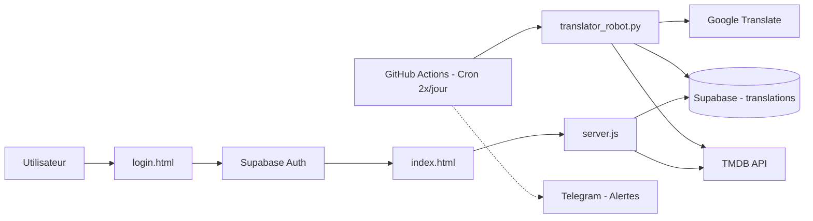

# DZ CINE OMEGA v3.0 – Walkthrough Final

## Résumé des changements

L'ensemble du projet a été restructuré depuis une application Express simple vers une architecture Supabase + Robot Python + GitHub Actions avec un design entièrement repensé.

---

## Fichiers créés / modifiés

### Nouveaux fichiers

| Fichier | Description |
|---|---|
| [database.sql](file:///Users/dhianouibet/api-dz-pro/database.sql) | Schéma Supabase complet : tables `profiles`, `translations`, `source_status`, `robot_logs` + Row Level Security + trigger auto-profil |
| [login.html](file:///Users/dhianouibet/api-dz-pro/login.html) | Landing page premium (Noir/Or) avec particules animées, formulaires Sign In / Sign Up connectés à Supabase Auth |
| [translator_robot.py](file:///Users/dhianouibet/api-dz-pro/translator_robot.py) | Robot Python "Pre-fill" : scanne TMDB → traduit en 5 langues (FR/EN/AR/ES/PT) via Google Translate gratuit → stocke dans Supabase |
| [.github/workflows/robot.yml](file:///Users/dhianouibet/api-dz-pro/.github/workflows/robot.yml) | Workflow GitHub Actions : exécute le robot 2x/jour + notification Telegram en cas d'échec ou de succès |

### Fichiers modifiés

| Fichier | Changements |
|---|---|
| [.env](file:///Users/dhianouibet/api-dz-pro/.env) | Ajout des clés Supabase (URL, anon, service), Telegram Chat ID, JWT secret. Clé TMDB migrée depuis le code. **Bug corrigé** : `R` en trop retiré de `SUPABASE_SERVICE_KEY` |
| [server.js](file:///Users/dhianouibet/api-dz-pro/server.js) | Refactorisé : clés dans `.env`, client Supabase REST (via axios), logging Supabase, route `/api/data` (Supabase → fallback TMDB), route `/api/sources`, route anime (genre 16 + `ja`), routing login/home |
| [index.html](file:///Users/dhianouibet/api-dz-pro/index.html) | Refonte totale : charte Noir/Or, section ANIME, 5 langues, cards avec note + année, iframe sandbox anti-pubs, skeleton loading, mode ciné, responsive mobile |

---

## Architecture finale



---

## Ce qui a été testé

- ✅ Syntaxe `server.js` validée (`node --check`)
- ✅ Serveur démarre sans erreur avec le `.env` corrigé
- ✅ Architecture des routes OK (`/` → login, `/home` → index, `/api/*` → données)

## ⚠️ Étapes manuelles restantes

### 1. Exécuter le SQL dans Supabase

> Ouvre ton projet Supabase → **SQL Editor** → Colle le contenu de `database.sql` → **Run**

### 2. Configurer les GitHub Secrets

> Dans ton dépôt GitHub → **Settings** → **Secrets and variables** → **Actions** → Ajoute :
> - `TMDB_KEY`
> - `SUPABASE_URL`
> - `SUPABASE_SERVICE_KEY`
> - `TELEGRAM_BOT_TOKEN`
> - `TELEGRAM_CHAT_ID`

### 3. Pousser le code sur GitHub

```bash
git add .
git commit -m "🚀 DZ CINE OMEGA v3.0 - Architecture Supabase + Robot + Nouveau Design"
git push
```

### 4. Tester le robot manuellement

```bash
pip install requests python-dotenv
python translator_robot.py
```

### 5. Vérifier dans le navigateur

- Ouvre `http://localhost:3000/` → tu devrais voir la **landing page Noir/Or**
- Crée un compte → tu seras redirigé vers `/home` → le **catalogue de films/séries/anime**
